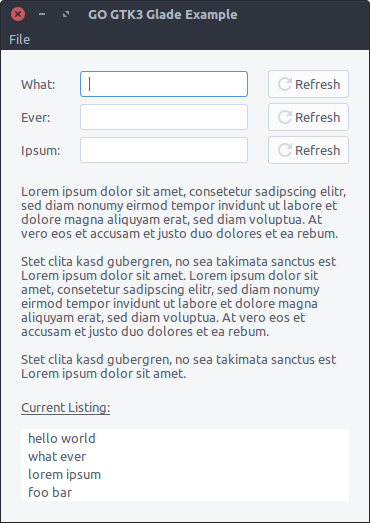

# Go GTK3 Glade Example

[](https://opensource.org/licenses/Apache-2.0)
[](https://goreportcard.com/report/github.com/mrccnt/gotk3-glade-example)

Experimenting with go and gtk using [gotk3](https://github.com/gotk3/gotk3) and [glade](https://glade.gnome.org/).



## Prerequisites

Install dev dependencies for `gtk`, `cairo` and `glib`

```bash
    sudo apt-get install libgtk-3-dev libcairo2-dev libglib2.0-dev
```

## Environment

    Ubuntu 16.04 LTS
    Go 1.8.3
    GTK 3.18

I set up GO environments vars for this project like this:

```bash
    export GOPATH=$(pwd)
    export GOBIN=$(pwd)/bin
```

## Dependencies

We also need to install [glide](https://glide.sh) as package manager. Install
dependencies in `./vendor` dir and link them in `./src` dir:

```bash
    glide install
    ln -sr vendor/github.com src/github.com
```

## Run, Install and Build

To make everything work, we need to pass a tag when using the code. Always
tag the build with you current gtk version, which in this case is `3.18`
(`gtk_3_18`):

```bash
    go run -v -tags gtk_3_18 main.go
    go test -v -tags gtk_3_18
    go install -v -tags gtk_3_18
    go build -v -tags gtk_3_18 -o dist/gotk3-glade-example
```

## Links

 * [Go bindings for GTK+3](https://github.com/gotk3/gotk3)
 * [Glade User Interface Designer](https://glade.gnome.org/)
 * [Glide Package Manager](https://glide.sh)